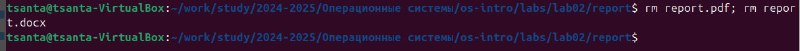

---
## Front matter
title: "Oтчёт по лабораторной работе 03"
subtitle: "НММбд-04-24"
author: "Ракутуманандзара Цантамписедрана Сарубиди"

## Generic otions
lang: ru-RU
toc-title: "Содержание"

## Bibliography
bibliography: bib/cite.bib
csl: pandoc/csl/gost-r-7-0-5-2008-numeric.csl

## Pdf output format
toc: true # Table of contents
toc-depth: 2
lof: true # List of figures
lot: true # List of tables
fontsize: 12pt
linestretch: 1.5
papersize: a4
documentclass: scrreprt
## I18n polyglossia
polyglossia-lang:
  name: russian
  options:
	- spelling=modern
	- babelshorthands=true
polyglossia-otherlangs:
  name: english
## I18n babel
babel-lang: russian
babel-otherlangs: english
## Fonts
mainfont: IBM Plex Serif
romanfont: IBM Plex Serif
sansfont: IBM Plex Sans
monofont: IBM Plex Mono
mathfont: STIX Two Math
mainfontoptions: Ligatures=Common,Ligatures=TeX,Scale=0.94
romanfontoptions: Ligatures=Common,Ligatures=TeX,Scale=0.94
sansfontoptions: Ligatures=Common,Ligatures=TeX,Scale=MatchLowercase,Scale=0.94
monofontoptions: Scale=MatchLowercase,Scale=0.94,FakeStretch=0.9
mathfontoptions:
## Biblatex
biblatex: true
biblio-style: "gost-numeric"
biblatexoptions:
  - parentracker=true
  - backend=biber
  - hyperref=auto
  - language=auto
  - autolang=other*
  - citestyle=gost-numeric
## Pandoc-crossref LaTeX customization
figureTitle: "Рис."
tableTitle: "Таблица"
listingTitle: "Листинг"
lofTitle: "Список иллюстраций"
lotTitle: "Список таблиц"
lolTitle: "Листинги"
## Misc options
indent: true
header-includes:
  - \usepackage{indentfirst}
  - \usepackage{float} # keep figures where there are in the text
  - \floatplacement{figure}{H} # keep figures where there are in the text
---

# Цель работы

Целью данной лабораторной работы является освоение процедуры оформления отчетов с помощью легковесного языка разметки Markdown.

# Задание

   1. Установка необходимого ПО

   2. Заполнение отчета по выполнению лабораторной работы No4 с помощью языка разметки Markdown

   3. Задание для самостоятельной работы

# Теоретическое введение

При выполнении лабораторной работы на своей технике необходимо установить следующее ПО:
• TeX Live (https://www.tug.org/texlive/) последней версии.
• Pandoc (https://pandoc.org/).
На компьютерах в дисплейных классах факультета физико-математических и естествен-
ных наук РУДН все необходимое ПО установлено.

# Выполнение лабораторной работы

Заполнение отчета по выполнению лабораторной работы No.3 с помощью языка разметки Markdown. I open the terminal. I go to the course catalog created during the previous laboratory work(рис 1) (рис. [-@fig:001]).

{#fig:001 width=70%}

Я обновляю локальный репозиторий, скачав изменения из удаленного репозитория с помощью команды git pull(рис 2).

{#fig:002 width=70%}

Я перейду в каталог с отчётом No.3 с помощью команду cd(рис 3).

{#fig:003 width=70%}

Я компилирую шаблон с использованием Makefile, вводя команду make(рис 4).

{#fig:004 width=70%}

Я открываю сгенерированные файлы report.docx LibreOffice и report pdf(рис 5)

{#fig:005 width=70%}

Полученные файлы я удалю с помощью Makefile, введя команду make clean. Командой ls проверяю, удалены ли созданные файлы(рис 6).

{#fig:006 width=70%}

Я открываю файл report.md с помощью любого текстового редактор(рис 16)

{#fig:007 width=70%}

Я хочу, чтобы у меня на всякий случай сохранился шаблон отчета, поэтому копирую файл с новым названием с помощью команду cp(рис 8)

{#fig:008 width=70%}

Я начинаю заполнять отчет с помощью языка разметки Markdown в скопированном файле(рис 9).

{#fig:009 width=70%}

Задание для самостоятельной работы Я перейду в каталог lab02/report с помощью команды cd(рис 10).

{#fig:0010 width=70%}

Я изменю имя с report.md на tsanta.lab2.md с помощью команды cp и запущу команду make(рис 11).

{#fig:0011 width=70%}

Я открываю файл с помощью текстового редактора и начинаю заполнять отчет(рис 12).

{#fig:0012 width=70%}

Я компилирую файл с отчетом по лабораторной работе(рис 13)

{#fig:0013 width=70%}

Я удаляю сгенерированные фаилы report.docx и report.pdf(рис 14)

{#fig:0014 width=70%}

Я добавляю изменения на GitHub с помощью комнадой git add и сохраняю изменения с помощью commit(рис 15)

{#fig:0015 width=70%}

Я отправлялю файлы на сервер с помощью команды git pull(рис 16)

{#fig:0016 width=70%}

# Выводы
В результате выполнения данной лабораторной работы я освоила процедуры оформления отчетов с помощью легковесного языка разметки Markdown.

# Список литературы{.unnumbered}

1. Архитектура ЭВМ

