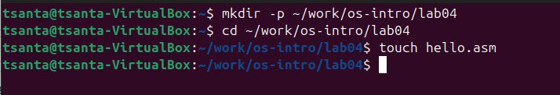
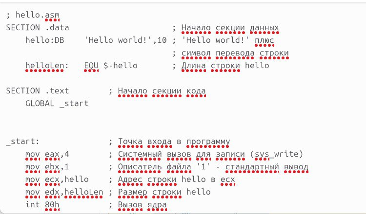
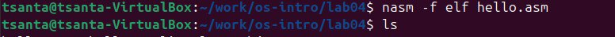
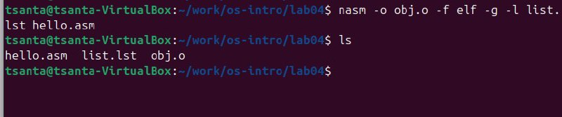
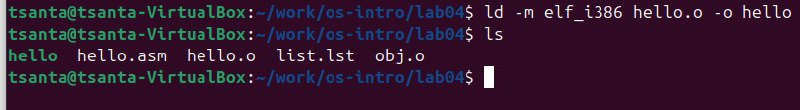
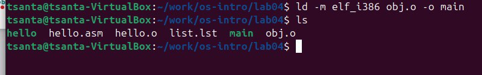

---
## Front matter
title: "Oтчёта по лабораторной работе 4"
subtitle: "НММбд-04-24"
author: "Ракутуманандзара Цантамписедрана Сарубиди"

## Generic otions
lang: ru-RU
toc-title: "Содержание"

## Bibliography
bibliography: bib/cite.bib
csl: pandoc/csl/gost-r-7-0-5-2008-numeric.csl

## Pdf output format
toc: true # Table of contents
toc-depth: 2
lof: true # List of figures
lot: true # List of tables
fontsize: 12pt
linestretch: 1.5
papersize: a4
documentclass: scrreprt
## I18n polyglossia
polyglossia-lang:
  name: russian
  options:
	- spelling=modern
	- babelshorthands=true
polyglossia-otherlangs:
  name: english
## I18n babel
babel-lang: russian
babel-otherlangs: english
## Fonts
mainfont: IBM Plex Serif
romanfont: IBM Plex Serif
sansfont: IBM Plex Sans
monofont: IBM Plex Mono
mathfont: STIX Two Math
mainfontoptions: Ligatures=Common,Ligatures=TeX,Scale=0.94
romanfontoptions: Ligatures=Common,Ligatures=TeX,Scale=0.94
sansfontoptions: Ligatures=Common,Ligatures=TeX,Scale=MatchLowercase,Scale=0.94
monofontoptions: Scale=MatchLowercase,Scale=0.94,FakeStretch=0.9
mathfontoptions:
## Biblatex
biblatex: true
biblio-style: "gost-numeric"
biblatexoptions:
  - parentracker=true
  - backend=biber
  - hyperref=auto
  - language=auto
  - autolang=other*
  - citestyle=gost-numeric
## Pandoc-crossref LaTeX customization
figureTitle: "Рис."
tableTitle: "Таблица"
listingTitle: "Листинг"
lofTitle: "Список иллюстраций"
lotTitle: "Список таблиц"
lolTitle: "Листинги"
## Misc options
indent: true
header-includes:
  - \usepackage{indentfirst}
  - \usepackage{float} # keep figures where there are in the text
  - \floatplacement{figure}{H} # keep figures where there are in the text
---

# Цель работы

Целью данной лабораторной работы является освоение процедуры оформления отчетов с помощью легковесного языка разметки Markdown.

# Задание

    1. Установка необходимого ПО
    2. Заполнение отчета по выполнению лабораторной работы №4 с помощью языка разметки Markdown
    3. Задание для самостоятельной работы

# Теоретическое введение

Markdown - легковесный язык разметки, созданный с целью обозначения форматирования в простом тексте, с максимальным сохранением его читаемости человеком, и пригодный для машинного преобразования в языки для продвинутых публикаций. Внутритекстовые формулы делаются аналогично формулам LaTeX. В Markdown вставить изображение в документ можно с помощью непосредственного указания адреса изображения. Синтаксис Markdown для встроенной ссылки состоит из части [link text], представляющей текст гиперссылки, и части (file-name.md) – URL-адреса или имени файла, на который дается ссылка. Markdown поддерживает как встраивание фрагментов кода в предложение, так и их размещение между предложениями в виде отдельных огражденных блоков. Огражденные блоки кода — это простой способ выделить синтаксис для фрагментов кода.

# Выполнение лабораторной работы

##1 Создание программы Hello world!

я буду использовать mkdir для создания указанного каталога, а затем с помощью команды cd войду в каталог, в котором буду работать, там я создам пустой текстовый файл «hello.asm» с помощью команды touch (рис 1).

{#fig:001 width=70%}

Я открываю созданный файл в текстовом редакторе и заполню файл, вставив в него программу вывода «Hello word!» (рис 2).

{#fig:002 width=70%}

##2 Транслятором NASM

Я преобразую текст программы в вывод «Hello world!» в объектный код с помощью транслятора NASM с помощью команды nasm -f elf hello.asm. Далее проверяю правильность выполнения команды с помощью команды ls и, как показано, файл hello.o создан (рис3).

{#fig:003 width=70%}

###3 Расширенным синтаксисом командной строки NASM

Я введу команду, которая скомпилирует файл hello.asm в файл obj.o, и файл будет содержать символы отладки (переключатель -g), также используя переключатель -l будет создан файл листинга list.lst. Далее проверяю с помощью команды ls правильность выполнения команды(рис 4)

{#fig:004 width=70%}

###4 Компоновщиком LD

Я передам объектный файл hello.o для обработки компоновщиком LD для создания исполняемого файла hello. Далее я использую команду ls, чтобы проверить правильность выполнения команды(рис 5).

{#fig:005 width=70%}

Теперь я создам файл с именем «main» с помощью данной команды.Объектный файл, из которого собран этот исполняемый файл, имеет имя obj.o(рис 6)

{#fig:006 width=70%}

# Выводы

Здесь кратко описываются итоги проделанной работы.

# Список литературы{.unnumbered}

::: {#refs}
:::
