---
## Front matter
title: "Oтчёт по лабораторной работе"
subtitle: "НММбд-04-24"
author: "Ракутуманандзара Цантамписедрана Сарубиди"

## Generic otions
lang: ru-RU
toc-title: "Содержание"

## Bibliography
bibliography: bib/cite.bib
csl: pandoc/csl/gost-r-7-0-5-2008-numeric.csl

## Pdf output format
toc: true # Table of contents
toc-depth: 2
lof: true # List of figures
lot: true # List of tables
fontsize: 12pt
linestretch: 1.5
papersize: a4
documentclass: scrreprt
## I18n polyglossia
polyglossia-lang:
  name: russian
  options:
	- spelling=modern
	- babelshorthands=true
polyglossia-otherlangs:
  name: english
## I18n babel
babel-lang: russian
babel-otherlangs: english
## Fonts
mainfont: IBM Plex Serif
romanfont: IBM Plex Serif
sansfont: IBM Plex Sans
monofont: IBM Plex Mono
mathfont: STIX Two Math
mainfontoptions: Ligatures=Common,Ligatures=TeX,Scale=0.94
romanfontoptions: Ligatures=Common,Ligatures=TeX,Scale=0.94
sansfontoptions: Ligatures=Common,Ligatures=TeX,Scale=MatchLowercase,Scale=0.94
monofontoptions: Scale=MatchLowercase,Scale=0.94,FakeStretch=0.9
mathfontoptions:
## Biblatex
biblatex: true
biblio-style: "gost-numeric"
biblatexoptions:
  - parentracker=true
  - backend=biber
  - hyperref=auto
  - language=auto
  - autolang=other*
  - citestyle=gost-numeric
## Pandoc-crossref LaTeX customization
figureTitle: "Рис."
tableTitle: "Таблица"
listingTitle: "Листинг"
lofTitle: "Список иллюстраций"
lotTitle: "Список таблиц"
lolTitle: "Листинги"
## Misc options
indent: true
header-includes:
  - \usepackage{indentfirst}
  - \usepackage{float} # keep figures where there are in the text
  - \floatplacement{figure}{H} # keep figures where there are in the text
---

# Цель работы

Целью данной работы является приобретение практических навыков работы в Midnight Commander. Также освойте инструкции на языке ассемблера mov и int.

# Задание

    1. Основы работы с mc
    2. Структура программы на языке ассемблера NASM
    3. Подключение внешнего файла
    4 Выполнение заданий для самостоятельной работы

# Выполнение лабораторной работы

3.1 Основы работы с mc

Я открою Midnight Commander, выполнив команду mc в терминале(рис 1)

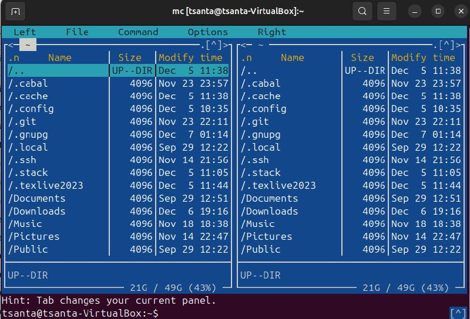{#fig:001 width=70%}

Я перейду в каталог ~/work/arch-pc, который я создал в лаборатории 4 в mc Commander(рис 2)

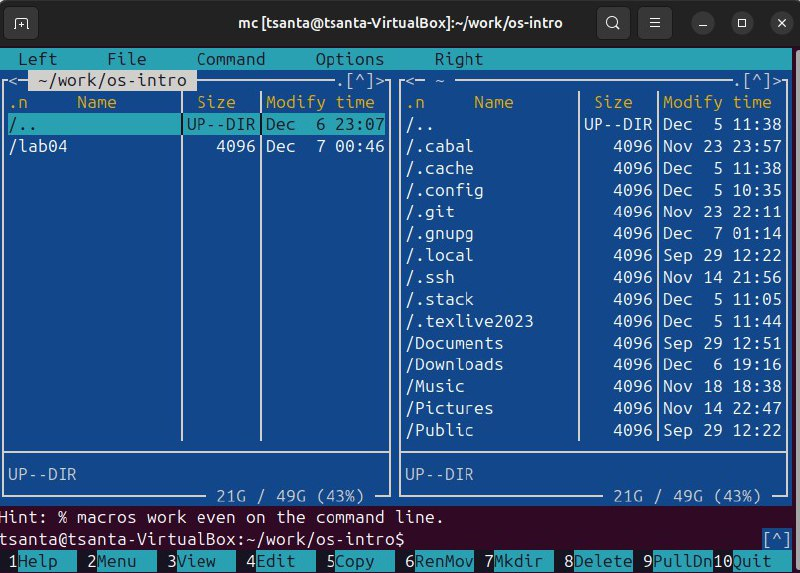{#fig:002 width=70%}

Я буду использовать функциональную клавишу F7, чтобы создать папку lab05 и перейти в созданный каталог(рис 3)

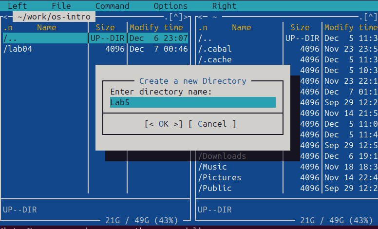{#fig:003 width=70%}

В строке ввода я напишу команду touch lab5-1.asm для создания файла, в котором буду работать(рис 4)

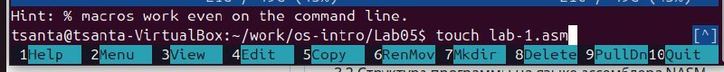{#fig:004 width=70%}

3.2 Структура программы на языке ассемблера NASM

Я открываю созданный файл для повторного редактирования.Я введу заданный текст программы,сохраню изменения и закрою файл(рис 5)

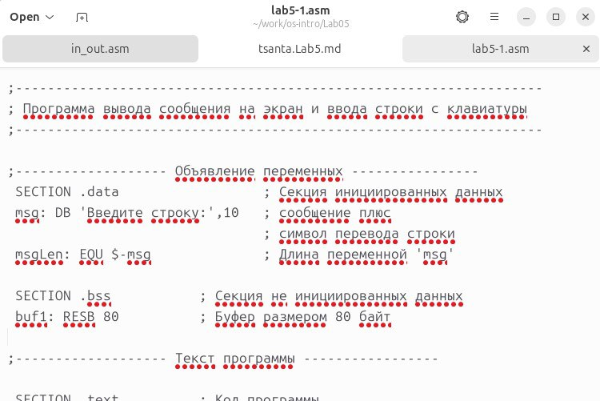{#fig:005 width=70%}

С помощью функциональной клавиши F3 открываю файл для просмотра, чтобы проверить, содержит ли файл текст программы(рис 6)

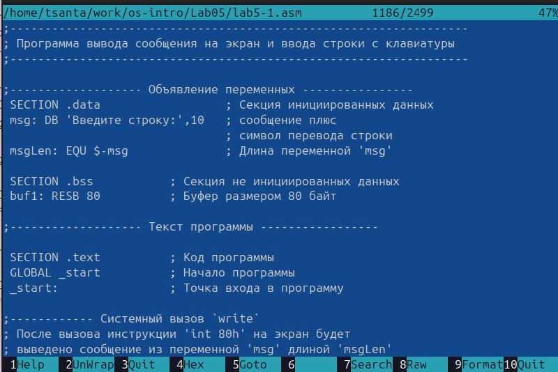{#fig:006 width=70%}

Сначала я переведу текст программы lab5-1.asm в объектный файл. Затем линкую объектный файл и запускаю полученный исполняемый файл.Программа выведет строку "Введите строку:" и ожидает ввода с клавиатуры. При появлении запроса я введу свое полное имя(рис 7)

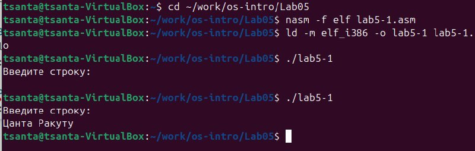{#fig:007 width=70%}

3.3.Подключение внешнего файла in_out.asm

Я скачаю файл in_out.asm со страницы курса в ТУИС и сохраню его в каталоге «Downloads»(рис 8)

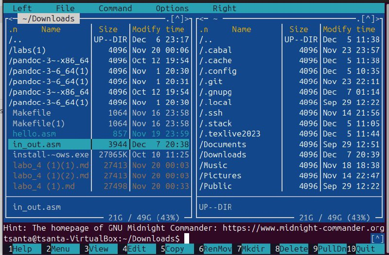{#fig:008 width=70%}

Функциональной клавишей F5 скопирую файл in_out.asm из каталога Downloads в созданный каталог lab05(рис 9)

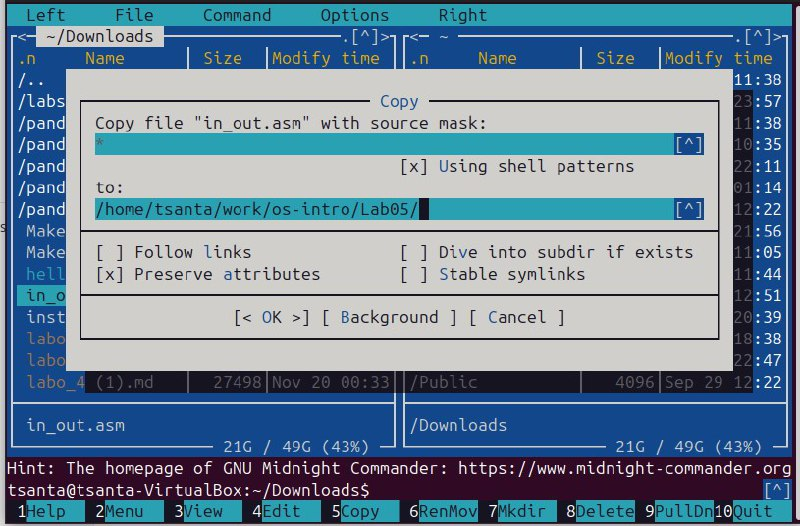{#fig:009 width=70%}

Функциональной клавишей F5 я скопирую файл lab5-1.asm в тот же каталог, но с другим именем; для этого в появившемся окне mc я введу имя копии файла(рис 10)

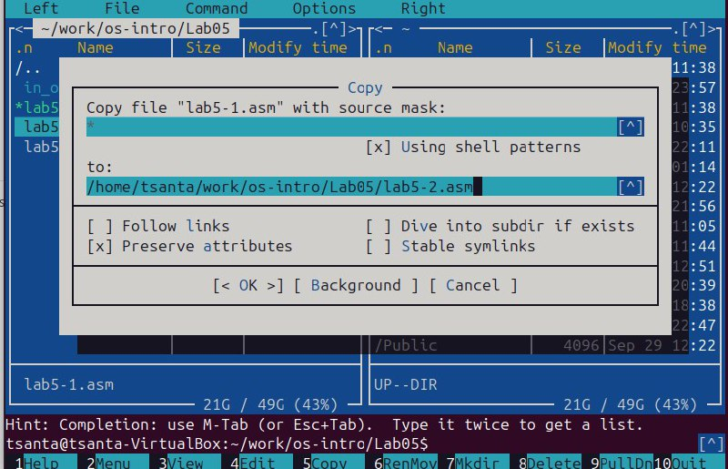{#fig:0010 width=70%}

Содержимое файла lab5-2.asm я изменю с помощью редактора, чтобы программа использовала подпрограммы из внешнего файла in_out.asm(рис 11)

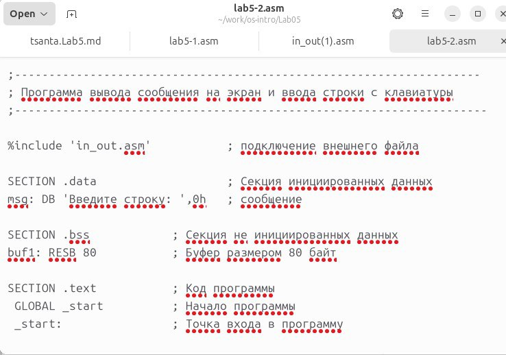{#fig:0011 width=70%}

Я переведу текст программы lab5-2.asm в объектный файл. Затем линкую объектный файл и запускаю полученный исполняемый файл.Программа выведет строку "Введите строку:" и ожидает ввода с клавиатуры. При появлении запроса я введу свое полное имя(рис 12)

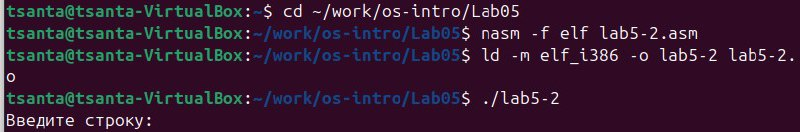{#fig:0012 width=70%}

Теперь я открою файл lab5-2.asm и поменяю место sprintLF на sprint. После этого я создам его исполняемый файл и запущу его, чтобы увидеть разницу(рис 13 и 14)

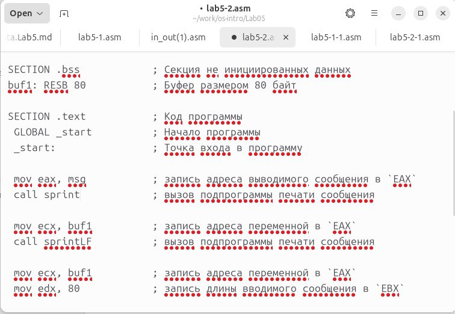{#fig:0013 width=70%}

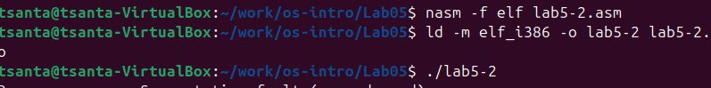{#fig:0014 width=70%}

Разница между первым исполняемым файлом lab5-2 и вторым lab5-2 заключается в том, что при запуске первого запрашивается перевод строки, а программа, запускающаяся при запуске второго, запрашивает ввод без перевода строки.

3.4 Задание для самостоятельной работы

1.Я создам копию файла lab5-1.asm с именем lab5-1-1.asm с помощью функциональной клавиши F5(рис 15)

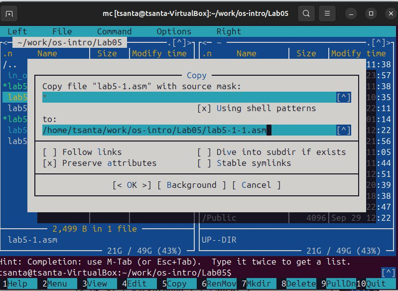{#fig:0015 width=70%}

Я открою созданный файл для редактирования. Я изменяю программу так, чтобы она помимо отображения подсказки и запроса на ввод отображала строку, введенную пользователем(рис 16)

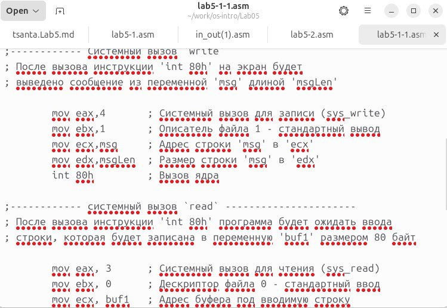{#fig:0016 width=70%}

2.Я переведу текст программы lab5-2.asm в объектный файл. Затем линкую объектный файл и запускаю полученный исполняемый файл.Программа выведет строку "Введите строку:" и ожидает ввода с клавиатуры. При появлении запроса я введу свою фамиилию(рис 17)

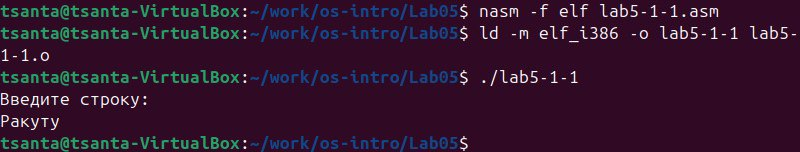{#fig:0017 width=70%}

Код программы из пункта 1:

SECTION .data ; Секция инициированных данных
msg:  DB 'Введите строку:',10 ; сообщение плюс
msgLen: EQU $-msg ; Длина переменной 'msg'
SECTION .bss ; Секция не инициированных данных
buf1:    RESB 80 ; Буфер размером 80 байт
SECTION .text ; Код программы
GLOBAL _start ; Начало программы
 _start: ; Точка входа в программу
mov eax,4 ; Системный вызов для записи (sys_write)
mov ebx,1 ; Описатель файла 1 - стандартный вывод
mov ecx,msg ; Адрес строки 'msg' в 'ecx'
mov edx,msgLen ; Размер строки 'msg' в 'edx'
int 80h ; Вызов ядра
mov eax, 3 ; Системный вызов для чтения (sys_read)
mov ebx, 0 ; Дескриптор файла 0 - стандартный ввод
mov ecx, buf1 ; Адрес буфера под вводимую строку
mov edx, 80 ; Длина вводимой строки
int 80h ; Вызов ядра
mov eax,4 ; Системный вызов для чтения(sys_exit)
mov ebx,1 ; Описатель файла '1' - стандартный вывод(без ошибок)
mov ecx, buf1 ; Адрес строки buf1 в есх
mov edx, buf1 ; Размер строки buf1
int 80h ; Вызов ядра
mov eax,1 ; Системный вызов для выхода (sys_exit)
mov ebx,0 ; Выход с кодом возврата 0 (без ошибок)
int 80h ; Вызов ядра

3.Я создам копию файла lab5-2.asm с именем lab5-2-1.asm с помощью функциональной клавиши F5(рис 18)

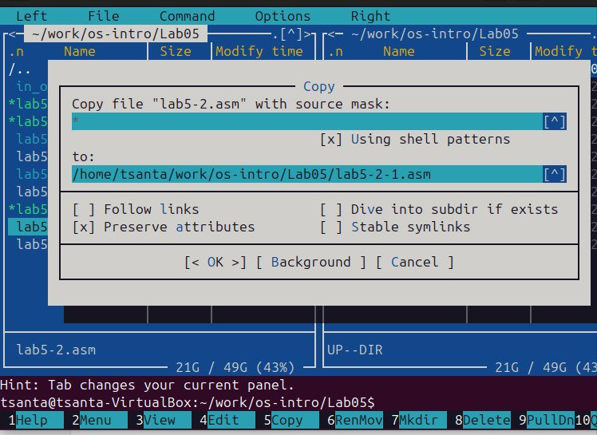{#fig:0018 width=70%}

Я открою созданный файл для редактирования. Я изменяю программу так, чтобы она помимо отображения подсказки и запроса на ввод отображала строку, введенную пользователем(рис 19)

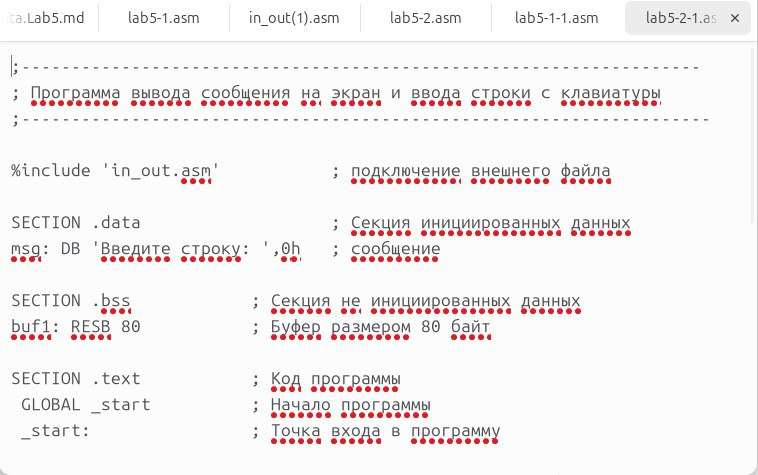{#fig:0019 width=70%}

4.Я создаю исполняемый файл и проверьте его работу(рис 20)

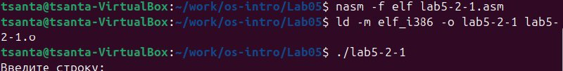{#fig:0020 width=70%}

Код программы из пункта 3:

%include 'in_out.asm' ; подключение внешнего файла
SECTION .data ; Секция инициированных данных
msg: DB 'Введите строку: ',0h ; сообщение
SECTION  .bss ; Секция не инициированных данных
buf1: RESB 80 ; Буфер размером 80 байт
SECTION .text ; Код программы
GLOBAL _start ; Начало программы
_start: ; Точка входа в программу
mov eax, msg ; запись адреса выводимого сообщения в `EAX`
call sprint ; вызов подпрограммы печати сообщения
mov ecx, buf1 ; запись адреса переменной в `EAX`
mov edx, 80 ; запись длины вводимого сообщения в `EBX`
call sread ; вызов подпрограммы ввода сообщения
mov eax,4 ; Системный вызов для чтения(sys_exit)
mov ebx,1 ; Описатель файла '1' - стандартный вывод(без ошибок)
mov ecx, buf1 ; Адрес строки buf1 в есх
mov edx, buf1 ; Размер строки buf1
int 80h ; Вызов ядра
call quit ; вызов подпрограммы завершения 

# Выводы

При выполнении данной лабораторной работы я приобрела практические навыки работы в Midnight Commander, а также освоила инструкции языка ассемблера mov и int.

# Список литературы{.unnumbered}

Архитектура ЭВМ
