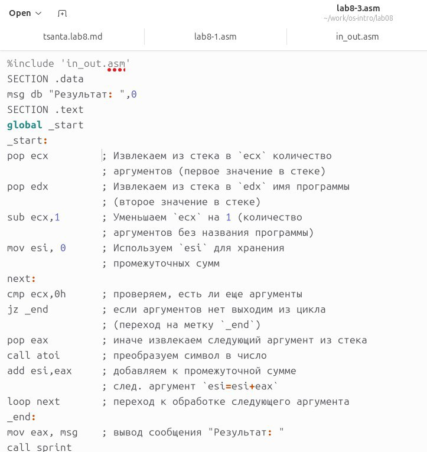

---
## Front matter
title: "Отчет по лабораторной работе No 8"
subtitle: "Дисциплины: Архитектура компьютера"
author: "Pакутуманандзара Цантамписедрана Сарубиди"

## Generic otions
lang: ru-RU
toc-title: "Содержание"

## Bibliography
bibliography: bib/cite.bib
csl: pandoc/csl/gost-r-7-0-5-2008-numeric.csl

## Pdf output format
toc: true # Table of contents
toc-depth: 2
lof: true # List of figures
lot: true # List of tables
fontsize: 12pt
linestretch: 1.5
papersize: a4
documentclass: scrreprt
## I18n polyglossia
polyglossia-lang:
  name: russian
  options:
	- spelling=modern
	- babelshorthands=true
polyglossia-otherlangs:
  name: english
## I18n babel
babel-lang: russian
babel-otherlangs: english
## Fonts
mainfont: IBM Plex Serif
romanfont: IBM Plex Serif
sansfont: IBM Plex Sans
monofont: IBM Plex Mono
mathfont: STIX Two Math
mainfontoptions: Ligatures=Common,Ligatures=TeX,Scale=0.94
romanfontoptions: Ligatures=Common,Ligatures=TeX,Scale=0.94
sansfontoptions: Ligatures=Common,Ligatures=TeX,Scale=MatchLowercase,Scale=0.94
monofontoptions: Scale=MatchLowercase,Scale=0.94,FakeStretch=0.9
mathfontoptions:
## Biblatex
biblatex: true
biblio-style: "gost-numeric"
biblatexoptions:
  - parentracker=true
  - backend=biber
  - hyperref=auto
  - language=auto
  - autolang=other*
  - citestyle=gost-numeric
## Pandoc-crossref LaTeX customization
figureTitle: "Рис."
tableTitle: "Таблица"
listingTitle: "Листинг"
lofTitle: "Список иллюстраций"
lotTitle: "Список таблиц"
lolTitle: "Листинги"
## Misc options
indent: true
header-includes:
  - \usepackage{indentfirst}
  - \usepackage{float} # keep figures where there are in the text
  - \floatplacement{figure}{H} # keep figures where there are in the text
---

# Цель работы

Целью лабораторной работы является приобретение навыков написания программ с использованием циклов и обработки аргументов командной строки.

# Задание

1. Реализация циклов в NASM
 
2. Обработка аргументов командной строки

3. Задание для самостоятельной работы


# Выполнение лабораторной работы

1. Реализация циклов в NASM

Я создам каталог для программ лабораторных работ 8, зайду в него и создам файл lab8-1.asm(рис 1)

{#fig:001 width=70%}

При реализации циклов в NASM с помощью инструкции цикла важно помнить, что эта инструкция использует регистр ecx в качестве счетчика и уменьшает его значение на единицу на каждом шаге. Теперь я открою созданный мной файл, затем скопирую и изучу текст данной программы(рис 2)

{#fig:002 width=70%}

Теперь я создам исполняемый файл и запущу его(рис 3)

{#fig:003 width=70%}

Я изменю текст программы, меняя в цикле значение регистра ecx(рис 4)

{#fig:004 width=70%}

Я создам исполняемый файл и проверю его работу(рис 5)

{#fig:005 width=70%}

Когда я запускаю программу, она отображает значения 3 , количество циклов не соответствует значению n

Чтобы использовать регистр ecx в цикле и обеспечить правильную работу программы, мне нужно использовать стек. Поэтому я внесу изменения в текст программы, добавив команды push и pop (добавление в стек и извлечение из стека), чтобы сохранить значение счетчика цикла(рис 6)

{#fig:006 width=70%}

Я создам исполняемый файл и проверю его работу(рис 7)

{#fig:007 width=70%}

В этом случае количество проходов цикла соответствует значению N, введенному с клавиатуры

2. Обработка аргументов командной строки

Я создам файл lab8-2.asm с помощью команды touch(рис 8)

{#fig:008 width=70%}

Когда вы запускаете программу, аргументы располагаются в стеке, поэтому, чтобы использовать аргументы в программе, их просто нужно извлечь из стека. Аргументы должны обрабатываться в цикле. Сначала вам нужно извлечь количество аргументов из стека, а затем просмотреть логику программы для каждого аргумента. Чтобы показать это, я скопирую данную программу в файл, который я только что создал(рис 9)

{#fig:009 width=70%}

Я создам исполняемый файл и проверю его работу(рис 10)

{#fig:0010 width=70%}

Я ввела три аргумента, и программа обработала количество введенных мной аргументов.

Я создам файл lab8-2.asm с помощью команды touch(рис 11)

{#fig:0011 width=70%}

Я открою его и скопирую в него заданную программу, программа отображает сумму чисел, которые передаются программе в качестве аргументов(рис 12)

{#fig:0012 width=70%}

Я создам исполняемый файл и проверю его работу(рис 13)

{#fig:0013 width=70%}

Я изменю программу так, чтобы она вычисляла произведение аргументов командной строки(рис 14)

{#fig:0014 width=70%}

Я создам исполняемый файл и проверю его работу(рис 15)

{#fig:0015 width=70%}

3. Задание для самостоятельной работы

Я создам файл lab8-4.asm с помощью команды touch(рис 16)

{#fig:0016 width=70%}

В созданном мной файле я напишу программу, которая находит сумму значений функции f(x) для x = x1, x2,x3.... и т. д. Программа должна вывести значение f(x1) + f(x2) + ... + f(xn). Значения x передаются в качестве аргументов. Тип функции f(x) я выберу из данной таблицы вариантов задания в соответствии с вариантом, полученным мной в ходе лабораторной работы 6.Мой вариант — вариант 12;f(x) = (15x-9)(рис 17)

{#fig:0017 width=70%}

Я создам исполняемый файл и проверю его работу(рис 18)

{#fig:0018 width=70%


Текстовая программа для самостоятельной работы

```
%include 'in_out.asm'

SECTION .data
msg1 db "f(x) = 15x - 9", 0
msg db "Результат: ", 0
SECTION .text
global _start
_start:
    mov eax, msg1
    call sprintLF
    pop ecx            
    pop edx            
    sub ecx, 1         
    xor esi, esi      
next:
    cmp ecx, 0         
    jz _end            
    pop eax           
    call atoi          
    mov ebx, 15        
    mul ebx            
    sub eax, 9        
    add esi, eax       
    dec ecx           
    jmp next           
_end:
    mov eax, msg       
    call sprint        
    mov eax, esi       
    call iprintLF     
    call quit          
```

# Выводы

Здесь кратко описываются итоги проделанной работы.Выполняя эту лабораторную работу, я приобрел навыки написания программ с использованием циклов и обработки аргументов командной строки.


# Список литературы{.unnumbered}

Архитектура ЭВМ
