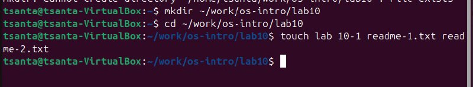
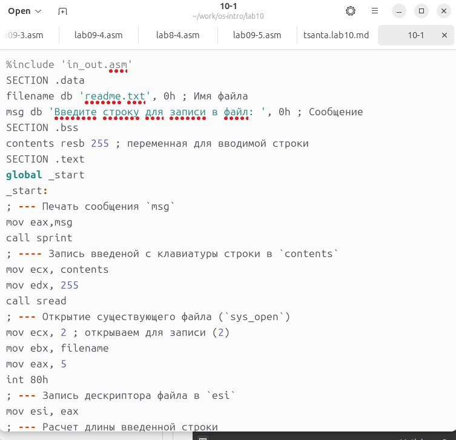
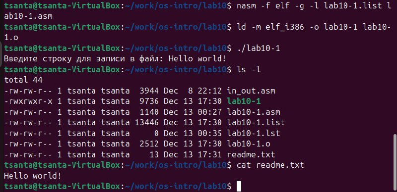
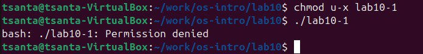
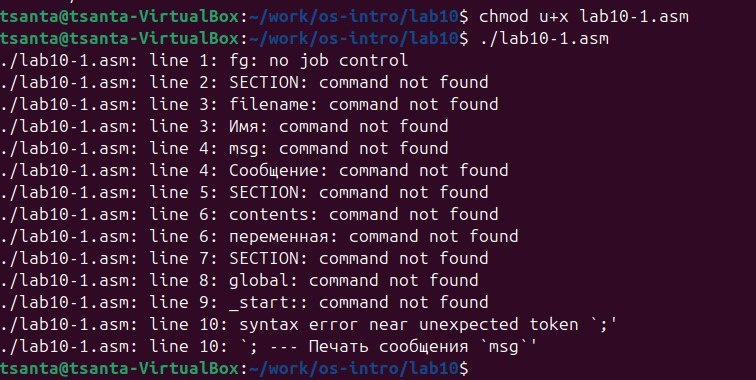
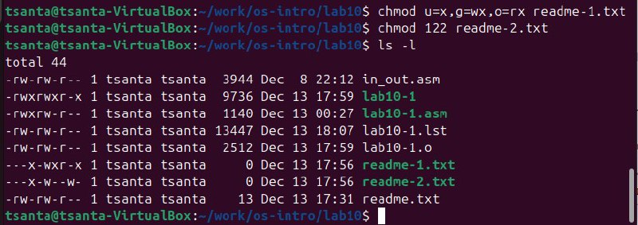
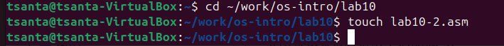
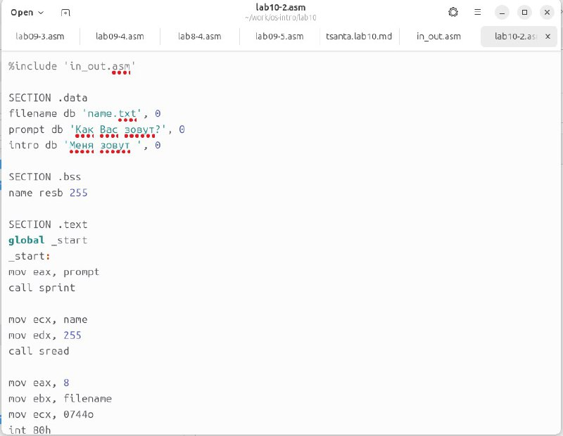
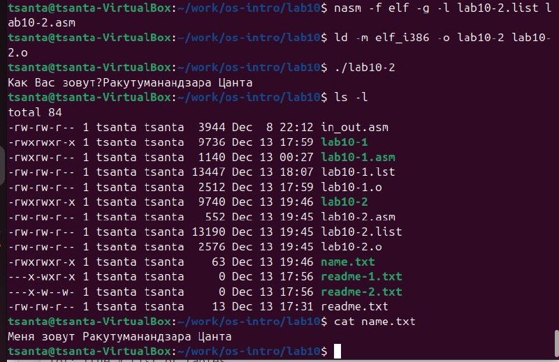

---
## Front matter
title: "Отчет по лабораторной работе No.10"
subtitle: "Дисциплины: Архитектура компьютера"
author: "Pакутуманандзара Цантамписедрана Сарубиди"

## Generic otions
lang: ru-RU
toc-title: "Содержание"

## Bibliography
bibliography: bib/cite.bib
csl: pandoc/csl/gost-r-7-0-5-2008-numeric.csl

## Pdf output format
toc: true # Table of contents
toc-depth: 2
lof: true # List of figures
lot: true # List of tables
fontsize: 12pt
linestretch: 1.5
papersize: a4
documentclass: scrreprt
## I18n polyglossia
polyglossia-lang:
  name: russian
  options:
	- spelling=modern
	- babelshorthands=true
polyglossia-otherlangs:
  name: english
## I18n babel
babel-lang: russian
babel-otherlangs: english
## Fonts
mainfont: IBM Plex Serif
romanfont: IBM Plex Serif
sansfont: IBM Plex Sans
monofont: IBM Plex Mono
mathfont: STIX Two Math
mainfontoptions: Ligatures=Common,Ligatures=TeX,Scale=0.94
romanfontoptions: Ligatures=Common,Ligatures=TeX,Scale=0.94
sansfontoptions: Ligatures=Common,Ligatures=TeX,Scale=MatchLowercase,Scale=0.94
monofontoptions: Scale=MatchLowercase,Scale=0.94,FakeStretch=0.9
mathfontoptions:
## Biblatex
biblatex: true
biblio-style: "gost-numeric"
biblatexoptions:
  - parentracker=true
  - backend=biber
  - hyperref=auto
  - language=auto
  - autolang=other*
  - citestyle=gost-numeric
## Pandoc-crossref LaTeX customization
figureTitle: "Рис."
tableTitle: "Таблица"
listingTitle: "Листинг"
lofTitle: "Список иллюстраций"
lotTitle: "Список таблиц"
lolTitle: "Листинги"
## Misc options
indent: true
header-includes:
  - \usepackage{indentfirst}
  - \usepackage{float} # keep figures where there are in the text
  - \floatplacement{figure}{H} # keep figures where there are in the text
---

# Цель работы

Цель данной лабораторной работы – помочь мне приобрести навыки написания программ для работы с файлами.


# Задание

1. Порядок выполнения лабораторной работы
2. Задание для самостоятельной работы

# Выполнение лабораторной работы

1. Порядок выполнения лабораторной работы

    Я создам каталог для программ лабораторных работ 10, зайду в него и создам файлы lab10-1.asm, readme-1.txt и readme-2.txt(рис 1)

{#fig:001 width=70%}

    Я открою и введу данную текстовую программу в файл lab10-1.asm(рис 2)

{#fig:002 width=70%}

Я создам исполняемый файл и проверю его работу(рис 3)

{#fig:003 width=70%}

    Я буду использовать команду chmod, чтобы изменить разрешения исполняемого файла lab10-1, чтобы предотвратить его выполнение(рис 4)

{#fig:004 width=70%}

После изменения разрешений я попыталася выполнить его, и он сказал «Permission denied», что означает, что я не могу его выполнить, потому что у меня нет на это разрешения.

    Теперь с помощью команды chmod изменю права доступа к файлу lab10-1.asm с исходным кодом программы, добавив права на выполнение(рис 5)

{#fig:005 width=70%}

При запуске файла он читает слова, которые не являются командами, как ошибки.

    По моему варианту я дам права доступа к файлу readme-1.txt в символьном виде (--x -wx r-x), а к файлу readme-2.txt в бинарном виде (001 010 010)Корректность выполнения проверю с помощью команды ls -l(рис 6)

{#fig:006 width=70%}

2. Задание для самостоятельной работы

Я создам файл lab10-2.asm(рис 7)

{#fig:007 width=70%}

Я напишу программу в созданном мной файле, которая будет следовать заданному алгоритму(рис 8)

{#fig:008 width=70%}

Я создам исполняемый файл и протестирую его работу, также проверю наличие файла и его содержимое с помощью команд ls и cat(рис 9)

{#fig:009 width=70%}

Текстовая программа для самостоятельной работы

```
%include 'in_out.asm'

SECTION .data
filename db 'name.txt', 0
prompt db 'Как Вас зовут?', 0
intro db 'Меня зовут ', 0

SECTION .bss
name resb 255

SECTION .text
global _start
_start:
mov eax, prompt
call sprint

mov ecx, name
mov edx, 255
call sread

mov eax, 8
mov ebx, filename
mov ecx, 0744o
int 80h

mov esi, eax

mov eax, intro
call slen
mov edx, eax
mov ecx, intro
mov ebx, esi
mov eax, 4
int 80h

mov eax, name
call slen
mov edx, eax
mov ecx, name
mov ebx, esi
mov eax, 4
int 80h

mov ebx, esi
mov eax, 6
int 80h

call quit
```


# Выводы

В ходе лабораторной работы я приобрeл навыки написания программ для работы с файлами.

# Список литературы{.unnumbered}

1. Архитектура ЭВМ
